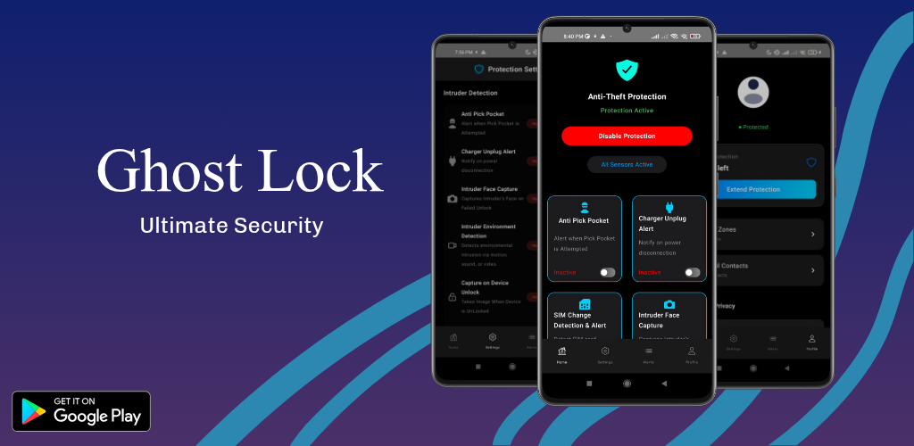

# 🛡️ GhostLock — Anti-Pickpocket App

> A privacy-first security app that uses AI to detect and alert against pickpocketing attempts in real time.

---

## 📱 Overview

**GhostLock** is a smart, AI-powered anti-pickpocket app that detects unauthorized movement and protects your phone in public or crowded places.

### 🔐 Key Features

- ✨ **AI Theft Detection**  
  Detects suspicious movement like a phone being pulled from your pocket or bag.

- 🔊 **Real-Time Alerts**  
  Instantly triggers vibration, sound, or locks your screen.

- 📍 **Location Reporting**  
  If untouched for 30 seconds, sends your location to a pre-set Gmail contact.

- 🚫 **No Ads**  
  100% distraction-free and privacy-respecting experience.

---

## 📥 Download

Grab it now on Google Play:  

---

## 🧠 Built With

- Kotlin
- CameraX
- ML Kit
- Lifecycle-aware Services
- SensorManager
- Firebase

---

## 🧑‍💻 Developer

**Nishkaam Innovations**  
[Website](https://chandravanshitechnologicalsolutions.com) | [Medium Blog](https://medium.com/@sasanksingh2074/stop-pickpockets-before-they-strike-with-just-your-phone-824427e191e3)

---

## 📸 Screenshots

---

## 📜 License

This project is licensed under the MIT License - see the [LICENSE](LICENSE) file for details.

---

> Protect your phone, effortlessly. ✨  
> _GhostLock: Stay alert, stay safe._

